# Online shop for the telegram bot

##### en

This telegram bot is needed in order to create your own store in the bot itself and start your business in the most popular messenger 

* Use python language, aiogram library, DB postgresql, docker

## Functions: 

user_panel

    Catalog 
    Cart
    Contacts

admin_panel 

    Add category
    Add product
    Delete product
    Bank card details
    Prepayment amount

## Demo 

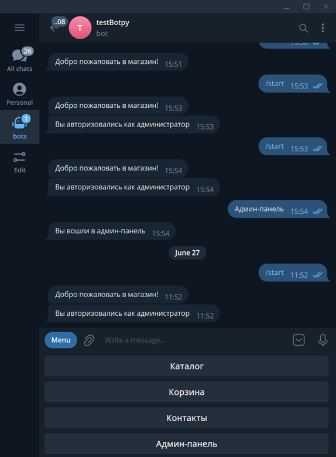

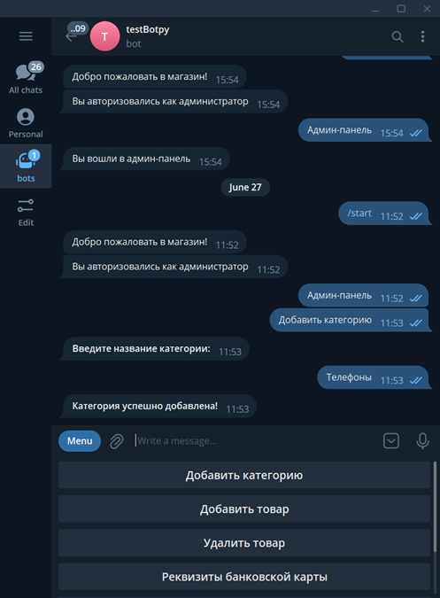
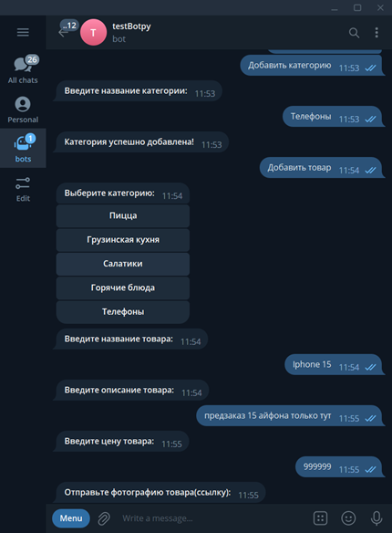
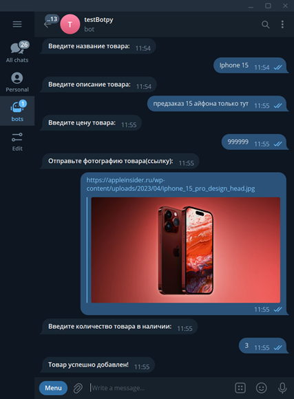
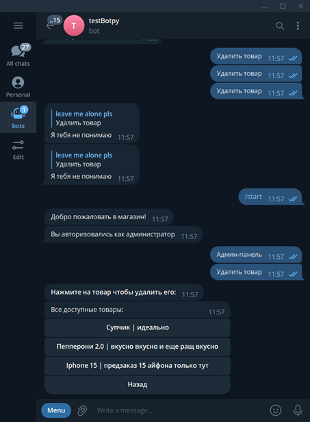

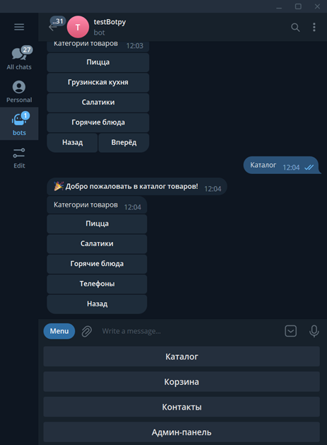
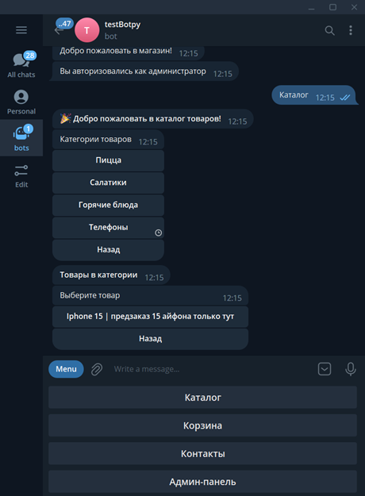
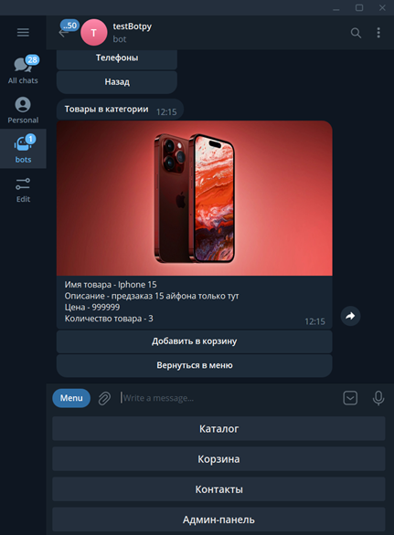
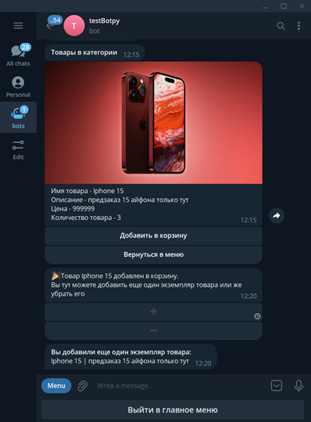
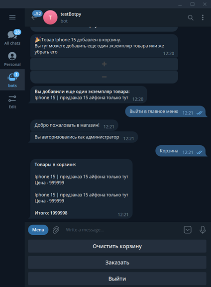

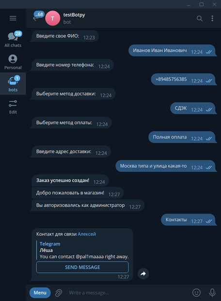

## Docker 

```commandline
docker-compose up
```

##### ru 

Данный телеграмм-бот нужен для того, чтобы создать свой собственный магазин и начать свой бизнес в самом популярном мессенджере. 

Технологии, которые использовались для создания этого бота: 
* язык программирования Python
* библиотека aiogram
* база данных Postgresql
* Docker


## Функции бота

Для пользоваталей доступно: 

    Каталог
    Корзина 
    Контакты 


Для админов доступно: 

    Добавление категории
    Добавление товара 
    Удаление товара 
    Реквизиты банковской карты 
    Размер предоплаты 
    Выйти из админ-панели

## Демонстрация


## Docker

```commandline
docker-compose up
```

    