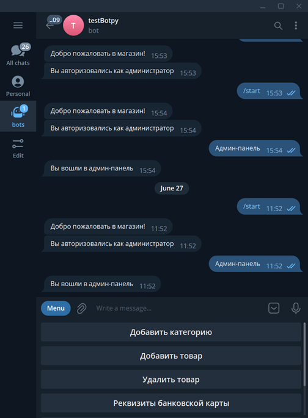
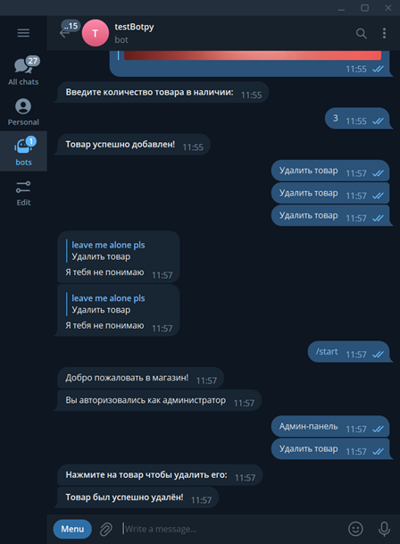
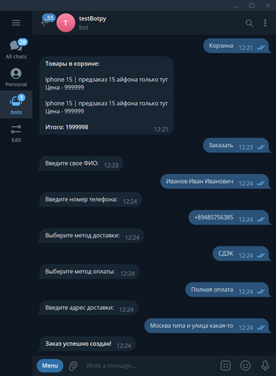

<div align="center">


<p>store bot is an amazing and useful thing for your business</p>
</div>

# ⚒ Stack 

* Python
* PostgreSQL
* Docker
* Aiogram
* Psycopg2

# 📊 Database


# Demo 











## Docker 

```commandline
docker-compose up
```

    